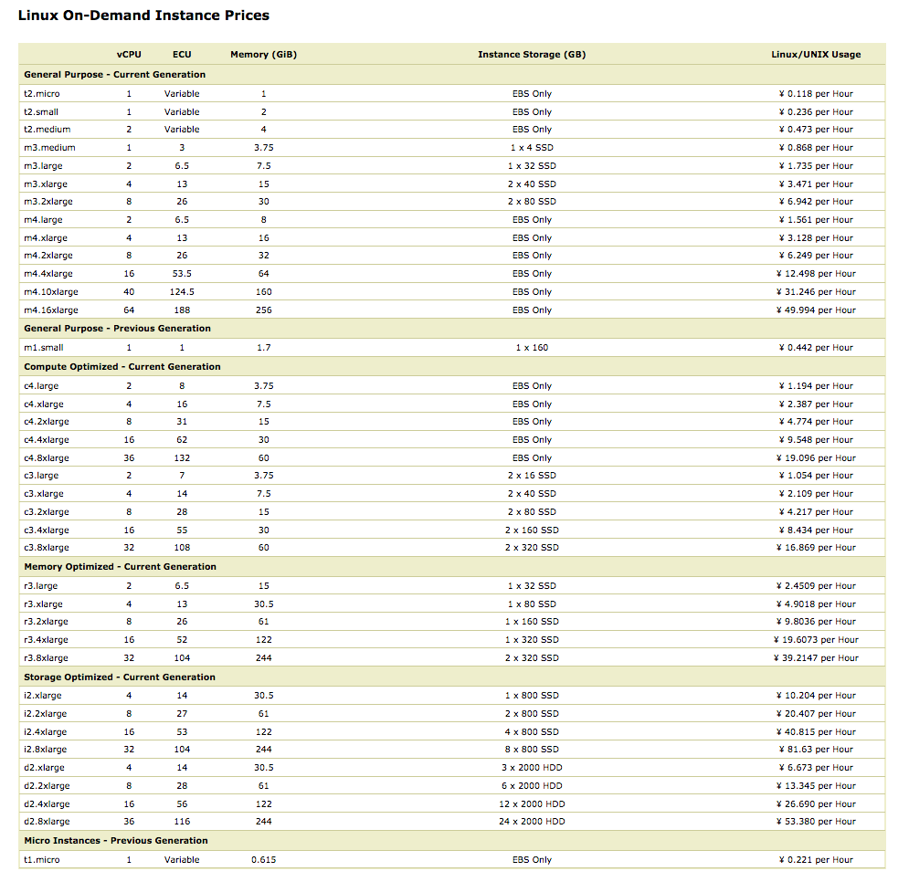

# AWS infrastructure

We use [Terraform](https://www.terraform.io) to start and destroy machines on AWS at our need.

1. Download terraform [here](https://www.terraform.io/downloads.html), and then extract terraform to your `$PATH`

    For example if `$HOME/bin` is in your `$PATH`
	```
    # for Mac OSX
    wget https://releases.hashicorp.com/terraform/0.7.11/terraform_0.7.11_darwin_amd64.zip
    unzip terraform_0.7.11_darwin_amd64.zip -d $HOME/bin
    # for Linux
    wget https://releases.hashicorp.com/terraform/0.7.11/terraform_0.7.11_linux_amd64.zip
    unzip terraform_0.7.11_linux_amd64.zip -d $HOME/bin

    # verify terraform installed correctly
    terraform version
    ```

2. Prepare AWS access key and ssh key pair

   ```sh
   $ mkdir -p $HOME/.aws
   $ cat $HOME/.aws/config
   [default]
   region=cn-north-1
   $ cat $HOME/.aws/credentials
   [default]
   aws_access_key_id=YOUR_ACCESS_KEY
   aws_secret_access_key=YOUR_SECRET_KEY
   $ chmod 400 $HOME/.ssh/pingcap.pem
   ```

3. Modify variables.tf and start AWS instances

   By default terraform will launch 4 ubuntu-14.04 instances, 3 for
   TiKV and 1 for both Pd and TiDB. If you want to deploy pd and tidb
   on different instances, uncomment `resource "aws_instance" "pd" {}`
   block in main.tf and `output "pd_ip" {}` block in outputs.tf.

   Normally you only need to change `servers`, `instance_type`,
   `root_size` variable in variables.tf. For `instance_type`, you can
   learn more from below picture 

   To preview what resources will be created, run `terraform
   plan`. It's always a good practice to run `terraform plan` before
   `terraform apply` and `terraform destroy`. If all seems ok, you can
   run `terraform apply` to create actual resources. wait some minutes
   and instance IPs will be printed at the end of execution.

   After `terraform apply` executed successfully, you can ssh into
   these instances by `ssh -i ~/.ssh/pingcap.pem ubuntu@IP_OF_INSTANCE`

   After finishing your test on AWS, you should destroy machines by
   `terraform destroy` to save money.

   **Do not delete terraform.tfstate before destroying instances**,
   actually this should be checked into git.

## TODO

* Multiple tests on the same VPC maybe conflict with each other
